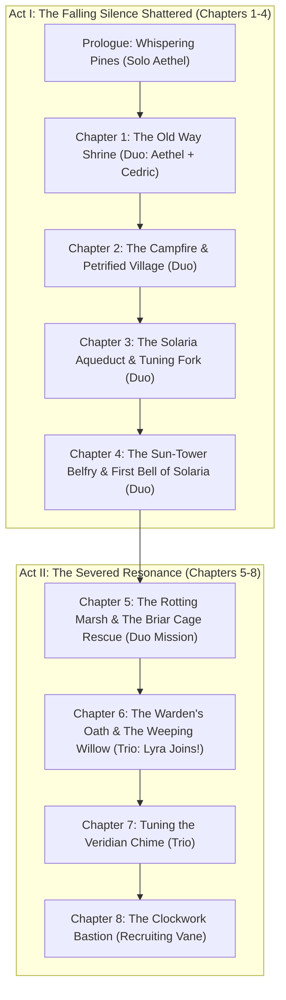

# VoiceRPG Android: Game Design & Technical Architecture Specification

**Title:** *Echoes of the Logos*  
**Platform:** Android Native (Kotlin, Jetpack Compose Canvas, Android Speech & TTS APIs)  
**Target Architecture:** Offline-first, 100% on-device speech processing, screenless/pocket accessibility, high-performance 60 FPS retro graphics.

---

## 1. Executive Summary & Vision

*Echoes of the Logos* is a retro-inspired JRPG designed natively for Android. It marries **first-person world and dungeon exploration** with **side-view tactical party combat** (in the vein of 16-bit *Final Fantasy VI* and *Chrono Trigger*), completely commandable through natural spoken voice or touch.

In addition to traditional screen play, the game is engineered as an **audio-first experience (Screenless / Pocket Mode)**, allowing gamers to play while walking with their phone in their pocket, or offering an uncompromised experience for blind and visually impaired players.

---

## 2. Core Architectural Pillars

### Pillar I: Screenless / Pocket Mode & Multi-Voice Narration
1. **Audio-First Design:**
   * Every game state, battle action, hero turn, enemy reinforcement, and narrative choice can be read aloud via Text-To-Speech.
   * Hands-free mic auto-listen continuously re-arms speech recognition after narration completes.
2. **Multi-Voice TTS Engine (`android.speech.tts.Voice`):**
   * Rather than relying solely on pitch shifting or a single system voice, the engine enumerates installed on-device voices and dynamically binds physical voice models to distinct characters:
     * **Sir Cedric:** Installed deep male baritone model.
     * **Aethel (Hero):** Heroic female / invocator voice model.
     * **Lyra:** Druidic nature warden voice model.
     * **Narrator:** Objective chronicle storyteller model.
   * Pitch modulation ($0.70\text{x}$ to $1.20\text{x}$) and speech rate adjustments serve as secondary expressive layers.
3. **Voice Meta-Commands:**
   * Players can speak system and status commands at any time:
     * *"Status"*, *"Enemies"*, *"Fellowship"*, *"Help"*
     * *"Toggle narration"*, *"Read choices"*, *"Pocket mode"*, *"Auto listen"*, *"Open options"*, *"Close options"*

---

### Pillar II: Narrative Hubs & Completed Option Elimination
1. **Non-Looping Progression Pattern:**
   * Exploration hubs (Camp, Aqueducts, Belfry, Drowned Fane) present multiple sub-story branches.
   * Each explored sub-story sets a persistent narrative completion flag (e.g. `substory_blight_complete`).
   * Upon returning to the hub, completed options are eliminated from the choice list.
   * When all sub-story options in a hub are completed, the hub node automatically transitions to the chapter milestone.
2. **16-Bit JRPG Visual Presentation:**
   * Left and right character portraits with subtle bobbing speech animations.
   * Ornate retro stone/parchment dialogue bubbles displaying speaker names, titles, and rich narrative prose.
   * High-atmosphere background art representing the current story location.

---

### Pillar III: Combat Party Fidelity & Dynamic Scalability
1. **Story-Grounded Party Rosters:**
   * Characters only appear in combat if they have joined the active party in the story:
     * **Act I (Chapters 1–4):** Strictly the **Duo Fellowship** (**Aethel** + **Sir Cedric**). Lyra does NOT appear in combat.
     * **Act II Chapter 5:** Strictly the **Duo Fellowship** on a rescue operation.
     * **Act II Chapter 6:** **Trio Fellowship** (**Aethel**, **Sir Cedric**, and **Lyra the Grove Warden**).
     * **Later Acts:** Expanding up to a full 4-hero party (recruiting Vane and Zephyr).
2. **Dynamic 4v6 Battle Arena:**
   * Up to 4 heroes on the right flank facing left.
   * Up to 6 enemies arranged in tactical **Front Row** (indices 0, 2, 4) and **Back Row** (indices 1, 3, 5).
   * **Mid-Battle Reinforcements:** Bosses and summoners can call minions mid-fight up to the hard 6-enemy field cap.
   * **Voice Targeting:** Supports targeting by name (*"Fireball the bog ironclad"*), title (*"Strike the gate captain"*), or ordinal index (*"Frost spike enemy 2"*).

---

### Pillar IV: The Incantation Resonance Engine
1. **Dual-Stream Speech Analysis:**
   * Evaluates spoken incantations across 5 mathematical pillars:
     1. **Thematic Vocabulary Density** (Pyromancy, Cryomancy, Electromancy, Holy, Shadow roots — up to $+45\%$).
     2. **Lexical Richness & Syllabic Cadence** (multi-clause syntax, poetic invocations — up to $+45\%$).
     3. **Acoustic Vocal Volume & Projection** (real-time decibel RMS — up to $+40\%$).
     4. **Vocal Inflection & Dynamic Crescendo** (pitch variance $\Delta F_0$ and volume swelling — up to $+40\%$).
     5. **Anti-Repetition Novelty Cache** (rewards fresh chants, penalizes spamming — up to $+30\%$).
2. **Resonance Multipliers & Visual Scaling:**
   * Bonus points yield damage/healing multipliers from **$1.0\times$ up to $3.0\times$ ($+200\%$)**.
   * Particle emitters scale dynamically from 40 basic embers up to 450+ cataclysmic swirling storm particles with screen shake and chromatic aberration.

---

### Pillar V: Character Creation & Persistent State
1. **Initial Loadout:**
   * Hero name, class selection (*Elementalist, Templar, Grove Warden, Shadowblade*), and starter aesthetic aura colors.
2. **JSON State Serialization (`SaveManager`):**
   * Persists all decisions made, narrative flags, completed encounters, party stats, and user audio preferences to `saves/active_game.json`.
   * Automatically restored on application launch.

---

## 3. Narrative Architecture: Chapter Roadmap

### Detailed Act II Breakdown:
* **Chapter 5: The Rotting Marsh & The Briar Cage Rescue:**
  * **Setting:** *The Murkmire Threshold & The Drowned Fane*.
  * **Plot:** Aethel and Cedric descend from Solaria into the poisoned marsh mist. They find signs of a desperate druidic retreat and discover Lyra imprisoned inside an obsidian Void-Briar Cage by the Blight Binder.
  * **Combat (`MARSH_RESCUE`):** Duo Fellowship (Aethel + Cedric) fights the Bog Ironclad, Mire Stalker, and Void Briar Binder with minion reinforcements to shatter the cage.
* **Chapter 6: The Warden's Oath & The Weeping Willow:**
  * **Setting:** *The Weeping Willow Sanctuary*.
  * **Plot:** Lyra recovers her strength, learns of Solaria's First Bell, and swears the Warden's Oath to join the fellowship.
  * **Combat (`SWAMP_BEHEMOTH`):** Trio Fellowship (Aethel + Cedric + Lyra) fights the colossal Bog Behemoth and marsh leeches to cleanse the sacred pool and uncover the Second Great Bell: *The Veridian Chime*.

---

## 4. Technical Stack Summary

| Subsystem | Technology | Specifications |
| :--- | :--- | :--- |
| **Language & Tooling** | Kotlin 1.9+, Gradle 8.4+ | JDK 17, Min SDK 26, Compile/Target SDK 34 |
| **UI Framework** | Jetpack Compose + Compose Canvas | 60 FPS hardware accelerated rendering |
| **Speech Recognition** | `android.speech.SpeechRecognizer` | 100% on-device offline recognition (`EXTRA_PREFER_OFFLINE`) |
| **Text-To-Speech** | `android.speech.tts.TextToSpeech` | Multi-voice selection via `tts.voices`, dynamic per-speaker binding |
| **Persistence** | Custom JSON Engine (`SaveManager`) | Atomic file writes, schema backward-compatibility |
| **Testing** | JUnit 4, Kotlin Coroutines Test | Headless test support, 100% unit-tested game mechanics |
| **Deployment** | Android Debug Bridge (ADB) | Wi-Fi wireless debugging & automated GitHub release pipeline |
