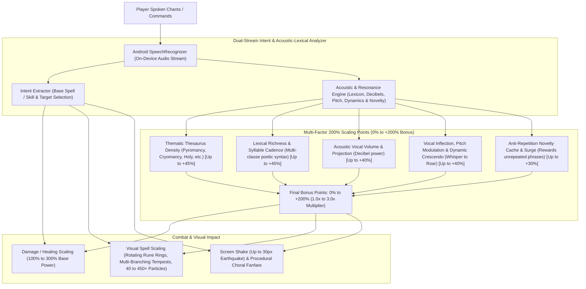
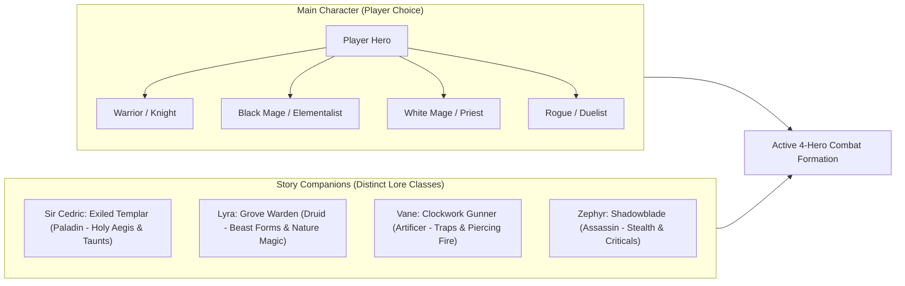

# VoiceRPG Android: Game Design & Technical Architecture

**Working Title:** *Echoes of the Logos*  
**Platform:** Android Native (Kotlin, Jetpack Compose Canvas, Android Speech API)  
**Target Architecture:** Offline-first, 100% on-device speech processing, high-performance 60 FPS retro graphics.

---

## 1. Executive Summary & Vision

*Echoes of the Logos* is a retro-inspired, high-production JRPG designed natively for Android. It marries **first-person dungeon and world exploration** (evoking classic *Wizardry*, *Etrian Odyssey*, and *Shining in the Darkness*) with **side-view tactical party combat** (in the vein of 16-bit *Final Fantasy VI* and *Chrono Trigger*). 

Every aspect of gameplay—party commands, spell incantations, tactical positioning, dungeon navigation, and dialogue choices—is commanded via natural voice.

A centerpiece innovation of the game is the **Incantation Resonance Engine**: an on-device speech grading system that evaluates not only *what* spell the player is casting, but *how uniquely and evocatively* they chant it. Chants with high thematic resonance, lexical richness, and novelty receive up to a **+20% bonus to damage/healing** and trigger dramatically enhanced **visual particle density (up to 3.8x)**, screen shake, and auditory fanfare.

---

## 2. Core Visual Presentation & Aesthetic

### High-Production Retro (16-Bit "HD-Pixel" Style)
* **Visual Identity:** Rich, handcrafted pixel art sprites combined with modern visual polish: dynamic 2D lighting, chromatic aberration flashes, screen-shake impacts, floating damage numbers, and hardware-accelerated particle spell effects (embers, frost crystals, lightning arcs).
* **The Dual-Perspective Loop:**
  1. **World & Dungeon Exploration (First-Person):**
     * Players navigate stone corridors, ancient catacombs, bustling taverns, and enchanted forests through a first-person viewport framed by an ornate retro stone/gilded bezel.
     * Minimap and compass at the top corner track step-by-step progress.
     * Hands-free voice movement:
       * *"Step forward"*, *"Turn left"*, *"Turn around"*, *"Check the iron door"*, *"Open the gilded chest"*, *"Speak with the tavern keeper"*.
  2. **Combat Encounters (Side-View Tactical Battle):**
     * Shattering screen transition into battle.
     * **Layout:**
       * **Left Flank (Party):** Up to 4 active party members in classic 32-bit combat stances (ready, casting, damaged, fallen) on the left flank facing right.
       * **Right Flank (Enemies):** Animated monster pixel sprites with breathing cycles, hit reactions, and segmented HP/barrier gauges on the right flank facing left.
       * **Top HUD:** Turn-order initiative track (ATB / round-based timeline) with active hero highlight and environment selector.
       * **Bottom HUD Console:** Live voice transcription terminal displaying the player's recognized words in glowing pixel typography with real-time Resonance Meter feedback.

### The Four-Frame Living Background Rule
All combat arena backgrounds must feature **four distinct animation frames** looping cyclically (at ~350ms to 450ms per frame) to ensure the environment feels dynamic, alive, and atmospheric without distracting from combat readability:

* **Rule Principles:**
  1. **Wind & Foliage Motion:** Living vegetation (canopy branches, vines, marsh reeds, grass blades) must bend, sway, and oscillate across the 4 frames.
  2. **Dynamic Light & Shadow Shifting:** Light sources (braziers, torches, bioluminescent flora, crystal gleams) must modulate between dim and bright flares, causing cast shadows on walls and floors to stretch, angle, and adjust.
  3. **Atmospheric Secondary Motion:** Floating environmental motes (drifting spores, sparks/embers, water droplets & ripple rings, wandering wisps) travel across predictable trajectory phases over the 4 frames.

#### The Five Canonical Environments
| Scene | Lore Location | 4-Frame Living Environmental Elements |
| :--- | :--- | :--- |
| **Forest** | *Ashwood Wilds* | Swaying tree canopies, grass blades rustling with wind gusts, shifting moonlit ground shadows, drifting golden spore/firefly motes. |
| **Castle** | *The Broken Garrison* | Stone parapets & crenellations, royal battle banners fluttering in the gale, iron wall braziers with crackling 4-stage flame tongues, drifting smoke embers, moving torchlight reflections across stone slabs. |
| **Dungeon** | *The Ashwood Sanctum* | Arched gothic masonry, wall sconces flickering between bright flares and dim embers, pillar shadows stretching and adjusting across flagstones, pulsing ancient cyan runic wall glyphs. |
| **Cave** | *Void Hollows* | Jagged stalactite ceiling with a 4-stage water droplet cycle (forming $\rightarrow$ falling $\rightarrow$ splash $\rightarrow$ expanding ripple ring), glowing amethyst/cyan crystal clusters with pulsing specular glints, shifting cavern wall shadows. |
| **Swamp Land** | *The Sunken Mire* | Draped moss and swaying cattails, toxic bioluminescent will-o'-the-wisps hovering and bobbing in a 4-frame sine loop, murky bog water pools with expanding bubble ripples, undulating swamp fog. |

---

## 3. The Incantation Resonance Engine

### Conceptual Architecture
Rather than forcing players into rigid, robotic commands ("Cast Fireball"), the game rewards creativity, roleplaying immersion, and lyrical expression while running entirely **offline** on the device.

### Uniqueness, Acoustic & Resonance Scoring Algorithm (100% On-Device)
The engine processes both the recognized text and raw acoustic audio properties along five mathematical pillars:

1. **Thematic Vocabulary Density (Spell Thesaurus — Up to +45%):**
   * Curated multi-tiered dictionaries of evocative elemental roots:
     * **Pyromancy (Fire):** *cinder, inferno, ash, blaze, ignite, scorching, incandescent, solar, phoenix, wrath, embers, consume*.
     * **Cryomancy (Ice):** *glacial, permafrost, frostbite, blizzard, crystalline, absolute zero, tundra, shards, bitter, freeze*.
     * **Electromancy (Lightning):** *tempest, thunderclap, galvanic, arc, storm, fulgur, lightning, volt, flash, strike*.
     * **Holy / Restoration:** *radiance, divine, seraph, celestial, dawn, sanctify, blessing, mend, aegis, purity*.
     * **Shadow / Rogue:** *umbra, abyss, venom, phantom, whisper, shroud, eclipse, silent, strike, hollow*.
2. **Lexical Richness, Syllable Cadence & Poetic Structure (Up to +45%):**
   * Evaluates word count, multisyllabic complexity, and poetic/archaic invocation formulas (*"O spirits of...", "descend from the heavens...", "unto the void..."*).
3. **Acoustic Vocal Volume & Projection (Up to +40%):**
   * Real-time decibel profiling via `onRmsChanged`:
     * Timid whisper / mumbling: $+0\%$
     * Conversational speaking ($5.0 - 7.0\text{ dB}$): $+18\%$
     * Heroic battle projection ($\ge 8.5\text{ dB}$): $+40\%$
4. **Vocal Inflection, Pitch Modulation & Dynamic Crescendo (Up to +40%):**
   * Evaluates dynamic volume range ($\Delta\text{dB}$) and fundamental pitch variance ($\Delta F_0\text{ in Hz}$):
     * Flat monotone: $+0\%$
     * Expressive pitch inflection ($\ge 25\text{ Hz variance}$): $+10\%$
     * Dramatic dynamic crescendo (building from whisper to climactic roar, $\ge 6.0\text{ dB dynamic range}$ with rising volume slope): $+30\%$
5. **Anti-Repetition Novelty Cache & Surge (Up to +30%):**
   * Rolling circular buffer of last 15 incantations. Repetitions decay points by 50% per repeat. Uttering a completely fresh, creative chant triggers a **+30% Novelty Surge**.

### Resonance Tiers, 200% Multipliers & Dynamic Visual Impact

$$\text{Final Damage} = \text{Base Damage} \times \left(1.0 + \frac{\text{Bonus Percent}}{100.0}\right) \quad [1.0\times \text{ to } 3.0\times]$$

| Tier | Bonus Multiplier | Damage Multiplier | Visual Particle Count | Spell Visual Effects | Example Chant & Delivery |
| :--- | :---: | :---: | :---: | :--- | :--- |
| **Basic** | $+0\% - 15\%$ | $1.0\times - 1.15\times$ | **40** (Standard) | Compact retro fireball sprite, basic impact SFX. | Flat tone: *"Fireball archer"* |
| **Adept** | $+20\% - 50\%$ | $1.2\times - 1.50\times$ | **90** (Enhanced) | Trailing ember particles, larger core, slight screen bump. | Normal voice: *"Burn the archer with blazing flames!"* |
| **Master** | $+55\% - 95\%$ | $1.55\times - 1.95\times$ | **180** (Dense) | Swirling flame vortex, flying spark clusters, heavy screen shake, bass boom. | Projected voice: *"Spirits of the cinder, engulf the archer in an inferno!"* |
| **Mythic** | $+100\% - 150\%$ | $2.0\times - 2.50\times$ | **300** (Storm Vortex) | Roaring meteor vortex, multi-layered orbital plasma rings, camera zoom shake. | Passionate crescendo: *"O ancient embers of the dragon's maw, hear my call and incinerate the shadow vanguard!"* |
| **Transcendental Logos** | **$+155\% - 200\%$ (MAX)** | **$2.55\times - 3.0\times$** | **450+** (Cataclysmic) | Full-screen chromatic aberration flash, giant solar super-core (4x scale), rotating arcane rune rings, 450+ particle firestorm vortex, screen-splitting shockwave, golden **"TRANSCENDENTAL LOGOS (+200%)"** banner! | Booming crescendo from whisper to roar: *"O primordial flame of the solar core, descend from the heavens and reduce that wretched archer to eternal ash!"* |

---

## 4. Party & Class Architecture

### Main Character Starting Classes
* **Knight (Warrior):** Heavy armor, tanking stances, cleaving physical strikes (*"Shield Wall"*, *"Power Slash"*, *"Challenge the front line"*).
* **Elementalist (Mage):** High-burst elemental spells (*"Ignite"*, *"Frost Spike"*, *"Chain Lightning"*).
* **Cleric (White Mage):** Healing, blessings, purification (*"Mend wounds"*, *"Bless party"*, *"Sanctuary"*).
* **Rogue (Thief):** Fast initiative, dual-wielding, poison daggers (*"Shadow Strike"*, *"Trip the beast"*, *"Steal"*).

### Companions & Lore Classes
Companions are recruited across the story and possess fixed, hand-crafted classes tied directly to their personal backstory:
* **Sir Cedric (Exiled Templar):** Holy Tank. Commands: *"Raise the Aegis"*, *"Smite the heretic"*, *"Stand between them and the mage"*.
* **Lyra (Grove Warden):** Nature Druid / Shifter. Commands: *"Call the pack"*, *"Entangle their feet in briars"*, *"Soothing rain upon the party"*.
* **Vane (Clockwork Gunner):** Steampunk Artificer. Commands: *"Deploy flash grenade"*, *"Target weak point with piercing shot"*, *"Overclock repeater"*.
* **Zephyr (Shadowblade):** Assassin. Commands: *"Vanish into the mist"*, *"Throat slice from behind"*, *"Venomous flurry"*.

---

## 5. Narrative Architecture: Chapters & Recruitment Vignettes

### The Overarching Lore: *The Silent Blight*
Magic in the realm of *Aethelgard* is drawn from the **Logos**—the primordial spoken word that brought existence into being. A creeping void known as the *Silent Blight* is spreading across the kingdom, corrupting ancient beasts into rabid husks and stripping mortals of their ability to speak. 

The player's party represents the last bastion of warriors and mages whose voices can still resonate with the Logos.

### Chapter Structure & Playable Character Vignettes
Each chapter features an overarching main story quest, environmental exploration, and a dedicated **Playable Companion Vignette** (a 10-15 minute interactive playable memory where the player controls the recruit during a pivotal moment in their past before they join the main party):

* **Prologue: The Ashwood Sanctum:**
  * Awaken in the ancient sanctum; select your Hero class; learn the basics of voice exploration and the Incantation Resonance Engine.
* **Chapter 1: The Broken Garrison:**
  * Journey to the frontier border to repel blighted war-beasts.
  * **Recruitment Vignette — *Sir Cedric's Last Stand*:** Play as Sir Cedric defending the cathedral gates against overwhelming numbers after being betrayed by his corrupt order. Once rescued, he swears his oath to your cause.
* **Chapter 2: The Sunken Mire:**
  * Traverse poisoned wetlands and sunken ruins to reach the weeping heart of the forest.
  * **Recruitment Vignette — *Lyra & the Corrupted Ancient*:** Play as Lyra desperately trying to cleanse her sacred grove and bond with her wolf companion amidst the first spread of the Blight.
* **Chapter 3: The Clockwork Citadel:**
  * Infiltrate the automated brass city of Ouros, where rogue automata protect ancient energy cores.
  * **Recruitment Vignette — *Vane's Great Clockwork Heist*:** Play as Vane sabotaging the inner vaults and deploying ingenious clockwork gadgets.

---

## 6. Technical Stack & Implementation Details

| Component | Implementation Technology | Key Details |
| :--- | :--- | :--- |
| **Platform** | Android Native (Kotlin) | Min SDK 26, Target SDK 35, Java 17. |
| **UI & Rendering** | Jetpack Compose + Compose Canvas | Declarative UI for menus/HUD; custom `Canvas` drawing loop for 60 FPS sprites & particle emitters. |
| **Speech Engine** | `android.speech.SpeechRecognizer` | 100% on-device offline recognition via `EXTRA_PREFER_OFFLINE`. Zero cloud latency (<150ms). |
| **Resonance Grader** | Kotlin Algorithmic Engine | Fast dictionary hash lookups, syllabic counter, and FIFO ring buffer for novelty checking. |
| **VFX Particle System** | Compose Canvas Particle Emitter | Emits 40 to 350+ particles per spell based on resonance multiplier with velocity, gravity, and alpha decay. |
| **Audio SFX** | Android `SoundPool` | Low-latency audio samples with runtime pitch and volume modulation. |
| **Persistence** | Android Room DB / DataStore | Game saves, party state, unlocked chapters, and custom incantation records. |

---

## 7. Development Roadmap

### Phase 1: Core Combat & Resonance Prototype (Immediate Next Step)
* Set up Gradle project with Android SDK 35 and Compose dependencies.
* Build `SpeechManager.kt` wrapping `android.speech.SpeechRecognizer` with `RECORD_AUDIO` runtime permissions.
* Implement `ResonanceGrader.kt` with Pyromancy, Cryomancy, and Electromancy thesauri, syllable counter, and novelty cache.
* Build `RetroBattleView.kt` with 16-bit side-view layout (party on right, goblin/orc sprites on left).
* Build Compose `Canvas` particle emitter demonstrating particle density scaling (Basic fireball $\rightarrow$ Logos Firestorm Vortex).

### Phase 2: First-Person Exploration Engine
* Implement grid-based dungeon crawler renderer with retro stone wall ray-casting / pseudo-3D textured planes.
* Voice navigation dispatcher (*"Forward"*, *"Turn left"*, *"Examine chest"*).
* First-person HUD with retro bezel and minimap.

### Phase 3: Party Progression & Vignettes
* Class data models, skills, and equipment inventories.
* Playable companion vignettes for Sir Cedric, Lyra, and Vane.
* Save system via Room DB.
